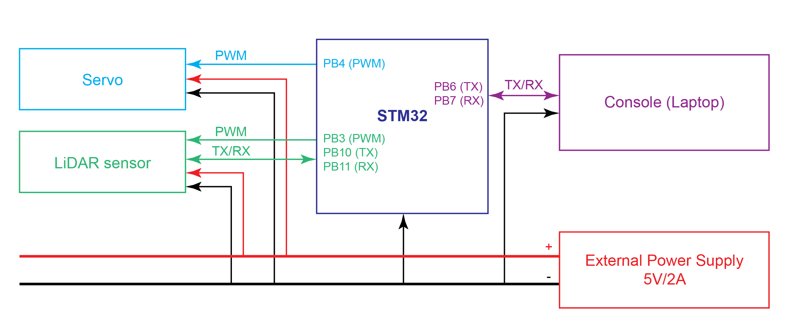

# LAMS Debugger

This is a debugger for LiDAR Autonomous Mapping System  (LAMS). The reason for a debugger is because the final project will be built with a SAME54 microcontroller instead of this STM32F0 Discovery board due to the need to write to an SD card over 2GB --- need SDHC protocol. 

This debugger sets up the use and communications of a RPLiDAR A2M8 and a medium-sized servo capable of 35kg torque (SPT5435LV-180W). This means implementing the communications protocol for the LiDAR sensor, controlling 2 PWM signals with 2 timers, and controlling 2 UART signals without interrupting each other (for the most part). 

## Pinouts

FTDI USB: Tx (PB6) / Rx (PB7) / GND (GND)

LiDAR: Tx (PB10) / Rx (PB11) / PWM (PB3)

Servo: PWM (PB4)

## Resources

### STM32F0 Discovery Board

[Peripherals Reference Manual](https://www.st.com/content/ccc/resource/technical/document/reference_manual/c2/f8/8a/f2/18/e6/43/96/DM00031936.pdf/files/DM00031936.pdf/jcr:content/translations/en.DM00031936.pdf)

[STM32F0xxx Cortex-M0 Core Manual](https://www.st.com/content/ccc/resource/technical/document/programming_manual/fc/90/c7/17/a1/44/43/89/DM00051352.pdf/files/DM00051352.pdf/jcr:content/translations/en.DM00051352.pdf)

[STM32F072xB Chip Datasheet](https://www.st.com/resource/en/datasheet/DM00090510.pdf)

[Discovery Kit User Manual](https://www.st.com/content/ccc/resource/technical/document/user_manual/3b/8d/46/57/b7/a9/49/b4/DM00099401.pdf/files/DM00099401.pdf/jcr:content/translations/en.DM00099401.pdf)

### RPLiDAR A2M8

[Datasheet](https://cdn.sparkfun.com/assets/e/a/f/9/8/LD208_SLAMTEC_rplidar_datasheet_A2M8_v1.0_en.pdf)

[Communications Protocol](https://www.robotshop.com/media/files/pdf2/rpk-02-communication-protocol.pdf)

### SPT5435LV-180

[Specifications](http://www.spt-servo.com/Product/015234339.html)
